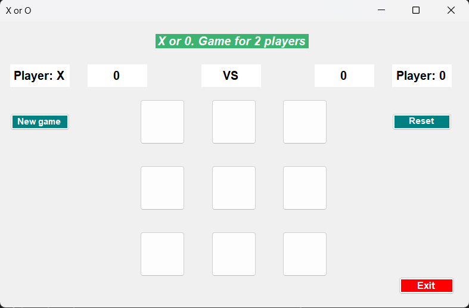

# TicTacToe

Играта X-O (или Tic-Tac-Toe) е класична игра за двајца играчи, кои наизменично прават потези на 3x3 табла. Едниот играч го користи знакот "X", додека другиот знакот "O". Целта на играта е да се формира линија од три исти знаци
хоризонтално, вертикално или дијагонално. Играчот кој успее прв да ја формира таква линија победува во рундата. Ако сите полиња на таблата се потполнат без победник, играта завршува нерешено.
Изглед на играта на почеток:

Кога имаме победник, се појавува прозорец кој објавува кој играч победил (X или O) и нуди опција за започнување на нова игра.

Кога сите полиња на таблата се потполнети, а нема победник, се појавува прозорец кој објавува дека играта завршила нерешено. Од тука, играчите имаат опција да изберат дали сакаат да започнат нова игра.

Ако играчите одберат дека не сакаат нова игра, играта која била во тек останува непроменета.

Играта има дополнително копче за нова игра ("New Game"), кое може да се притисне во секое време. По притискањето на копчето, играта се рестартира и започнува нова игра.

Играта има копче за рестартирање на резултатот. Кога се притисне ова копче, резултатот се рестартира, што означува дека се враќаме на почетокот на играта без да се ресетира целосно самата игра.

На играта X-O (Tic-Tac-Toe) на формата се поставени 9 копчиња, претставувајќи сите полиња на таблата. Секое копче може да биде кликнато за да се постави знакот "X" или "O", во зависност од кој играч е на потег. После секое кликнување на копче, се ажурира соодветната позиција во матрицата од знаци.
Откако играчот ќе направи потег, се повикува методот button_click(object sender, EventArgs e). Овој метод го одредува којо копче било кликнато, го поставува соодветниот знак ("X" или "O") во текстот на копчето и го оневозможува копчето за повторно кликање. Со секое кликнување, се зголемува бројачот на потези (count).
Откако се завршува потегот, методот проверува дали тој потег доведе до победник користејќи го методот checkForWinner(). Ако има победник, се прикажува соодветна порака и се зголемуваат поените за победникот. Ако нема победник, се проверува дали рундата завршила нерешено користејќи го методот checkForDraw(). Ако рундата не е завршена, се сменува играчот за следниот потег, променувајќи ги променливите turn и count.

Функцијата resetGame() е дефинирана да го рестартира статусот на играта X-O (Tic-Tac-Toe):

Променливите turn и count се рестартираат за да се постави играта во почетна состојба.
Секое копче на таблата се овозможува за клик (Enabled = true), се брише текстот (Text = ""), и позадинската боја се поставува на бела (BackColor = Color.White).
Оваа функција е корисна за ресетирање на таблата и претходните потези, што овозможува повторно играње без да се употребува рестартирање на целата апликација.
